# 알버트 오딧세이 2 v06 수정·검수 기록

ROM SHA-256: `0b00d3e6dc2f20bb9602ad359a6ba44780cdacbe1a89b846ecf576eb84776ac5`

이번에는 Snes9x 코어에서 게임을 실제로 실행하고 패드 입력으로 진행했습니다. 오프닝, 이름 입력, 첫 전투 진입, 상태창, 지형 커서, 이동과 취소, 특수 기술 선택·사용, 도구·장비 화면, 공격, 대기 방향 선택, 적의 턴과 필드 복귀를 확인했습니다. 전체 지형 50종과 기술 18종의 테이블은 수정했으며, 실제 플레이로 방문한 지형·사용한 기술은 아래 캡처 범위입니다. 엔딩까지의 플레이 검수는 하지 않았습니다.

## 원인과 수정

- 지형 50개 항목과 기술 18개 항목은 일반 번역 문자열 표를 거치지 않는 원본 타일 번호였습니다. 이 별도 표를 한글로 교체했습니다.
- 체력, 정신력, 이동력, 정상·상태 이상, 낮·밤·밝기, 지형 효과, 백분율은 코드 안의 일본어 글자 번호를 출력하고 있었습니다. 해당 경로를 수정했습니다.
- 장비 안내 6개와 도구 사용 안내 21개는 고정 길이 또는 길이 접두사 방식이어서 기존 문자열 검사에서 빠져 있었습니다. 모두 한글화했습니다.
- 필드에서 덮어써지는 기본 글꼴의 마지막 8칸은 별도 안전한 글자 칸으로 옮겼습니다. 추가 글꼴은 기존 대사 글꼴 작업 영역을 메뉴가 열릴 때 재사용합니다. 새 WRAM 버퍼를 할당하지 않습니다.
- 반복 커서 이동에서는 저장된 글꼴 조각을 비교하고 같으면 전송하지 않습니다. 장면·메뉴 복귀 때 필요한 경우에만 전송합니다.
- 확대 전투 화면의 명중률 `%`와 명령창의 `특수기술` 길이도 수정했습니다.

## 확인한 검사

- 대사 2,131개를 원래 CPU 처리 경로로 실행: 모두 반환, 경계 보호값 유지.
- 일반 UI 293개, 글꼴 장면 전환, 아이템 목록, 시계, 전투 통지 검사 통과.
- 새 글꼴 전송 범위 밖의 VRAM 불변, 작업 버퍼 경계 유지, 같은 글꼴 재호출 시 DMA 생략 확인.
- 코드 재배치는 10개 화면 모드로 검사했습니다. 적용 모드는 필드와 일반 마을 화면(1·3·4)입니다.
- UI 문자열 저장 영역 상한, 원본 이벤트 데이터 불변, SNES 체크섬, xdelta 재적용 결과 일치 확인.
- 일본어 원본, 1편 빌드와 이전 패치 파일, 사용자 저장 파일은 변경하지 않았습니다.

## 바뀐 표시 전체

기본 표시: 체력 / 정신력(짧은 칸: 정신) / 이동력(짧은 칸: 이동) / 공격 / 수비 / 특수 / 방어 / 정상 / 사망 / 석화 / 마비 / 중독 / 축복 / 지형 / 지형효과 / 낮 / 밤 / 밝기 / 없습니다 / : / % / 특수기술

### 지형 표 50개

| 번호 | 한글 |
|---:|---|
| 0 | 평야 |
| 1 | 삼림 |
| 2 | 황무지 |
| 3 | 도로 |
| 4 | 도로 |
| 5 | 언덕 |
| 6 | 마을 |
| 7 | 제방 |
| 8 | 바다 |
| 9 | 바다 |
| 10 | 바위땅 |
| 11 | 바위산 |
| 12 | 도시 |
| 13 | 바다 |
| 14 | 도로 |
| 15 | 땅 |
| 16 | 도시 |
| 17 | 바위산 |
| 18 | 바위땅 |
| 19 | 바다 |
| 20 | 도로 |
| 21 | 동굴 |
| 22 | 숲 |
| 23 | 삼림 |
| 24 | 언덕 |
| 25 | 동굴 |
| 26 | 삼림 |
| 27 | 언덕 |
| 28 | 바다 |
| 29 | 도로 |
| 30 | 얼음 |
| 31 | 바닥 |
| 32 | 바닥 |
| 33 | 바닥 |
| 34 | 바닥 |
| 35 | 바닥 |
| 36 | 바닥 |
| 37 | 바닥 |
| 38 | 늪 |
| 39 | 황무지 |
| 40 | 풀밭 |
| 41 | 눈밭 |
| 42 | 용암 |
| 43 | 구멍 |
| 44 | 용암 |
| 45 | 구멍 |
| 46 | 구멍 |
| 47 | 연못 |
| 48 | 용암 |
| 49 | 벽 |

### 기술 표 18개

| 번호 | 한글 |
|---:|---|
| 1 | 기합베기 |
| 2 | 화조 |
| 3 | 청사자 |
| 4 | 돌격 |
| 5 | 필중 |
| 6 | 열기 |
| 7 | 훔치기 |
| 8 | 회복 |
| 9 | 부활 |
| 10 | 치유 |
| 11 | 퇴마탄 |
| 12 | 뇌격 |
| 13 | 화염탄 |
| 14 | 냉동탄 |
| 15 | 마비탄 |
| 16 | 대회복 |
| 17 | 축복 |
| 18 | 난무 |

원본 기술 글꼴을 직접 확인했습니다. 특히 17번은 「祝福」으로, 「축복」입니다.

### 도구·장비 안내 27개

| 주소 | 한글 |
|---|---|
| 04F36E | 사용할 |
| 04F37B | 도구를 |
| 04F38A | 선택하세요 |
| 04F399 | X 버튼으로 정리합니다 |
| 04F3B4 | 이 도구는 사용할 수 없습니다 |
| 04F3D9 | 을 |
| 04F3DC | 누구에게 사용할지 |
| 04F3EF | 전투불능 동료가 없습니다 |
| 04F40A | 이 도구는 필드에서 사용합니다 |
| 04F42F | 사용할까요? |
| 04F43E | 경험치가 |
| 04F447 | 공격력이 |
| 04F450 | 명중률이 |
| 04F459 | 수비력이 |
| 04F462 | 회피율이 |
| 04F46B | 특수율이 |
| 04F474 | 방어율이 |
| 04F47D | 최대 체력이 |
| 04F48C | 최대 정신력이 |
| 04F49B | 이동력이 |
| 04F4A4 | 올랐다 |
| 04950D | 장비하기 |
| 049517 | 장비해제 |
| 049554 | 바꿀 장비를 선택하세요 |
| 04959D | 장비할 것을 선택하세요 |
| 0495E6 | 해제할 장비를 선택하세요 |
| 0498D5 | LV:체력 정신력/ |

## 실제 플레이 캡처

각 캡처의 입력 기록과 ROM 해시는 `ao2/analysis/gameplay_v06.json`에 있습니다. 아래 화면은 실제 게임에서 출력된 화면입니다.

### 오프닝·이름 입력 후 첫 전투

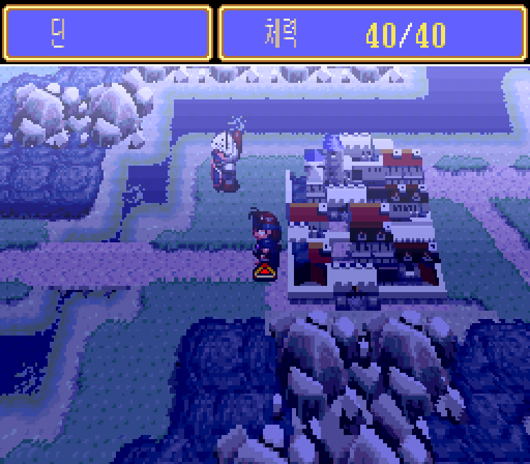

### 상태와 능력치

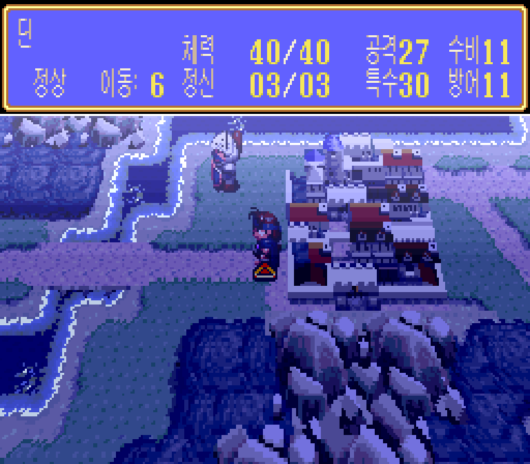

### 도로 지형

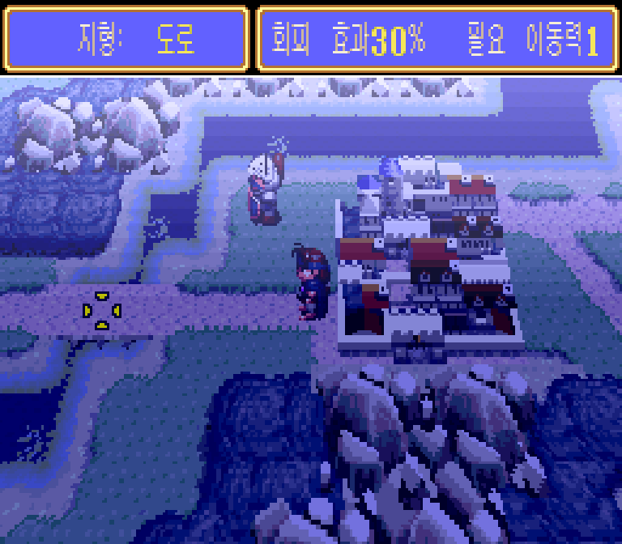

### 언덕 지형

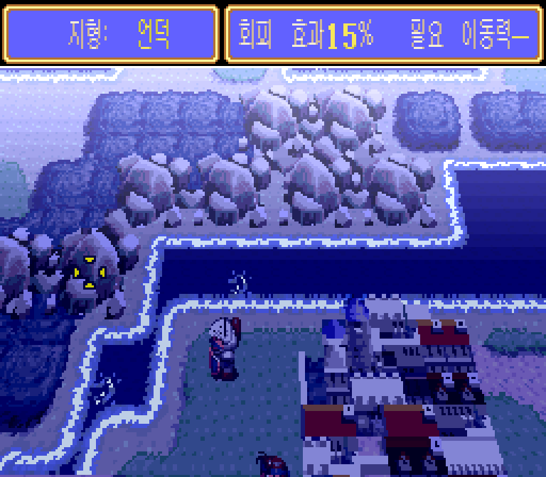

### 삼림 지형

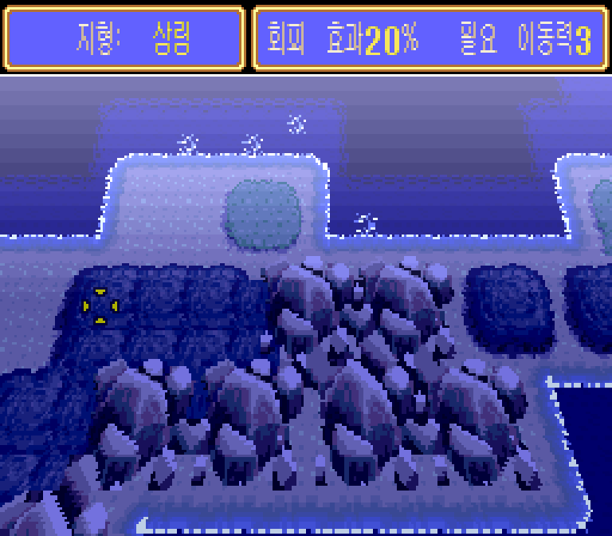

### 특수 기술 목록

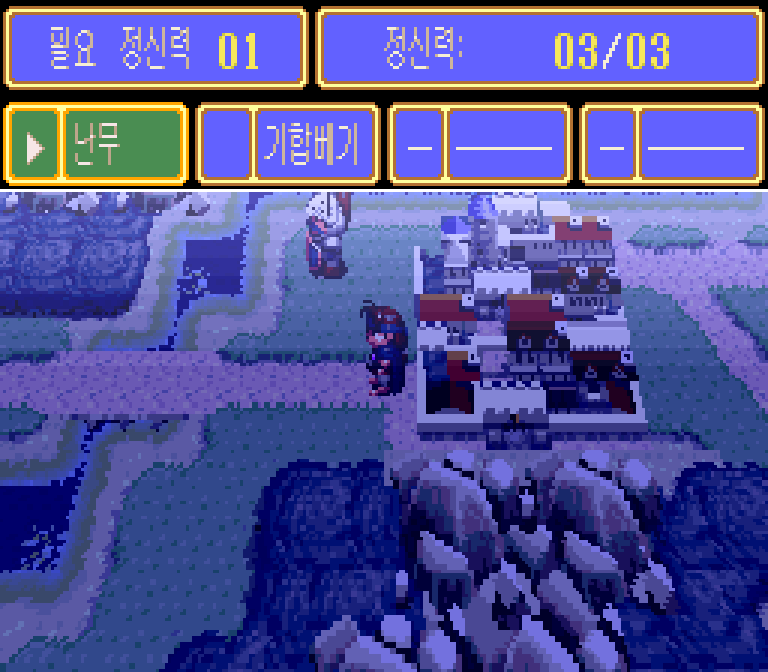

### 도구 안내와 빈 목록 정리

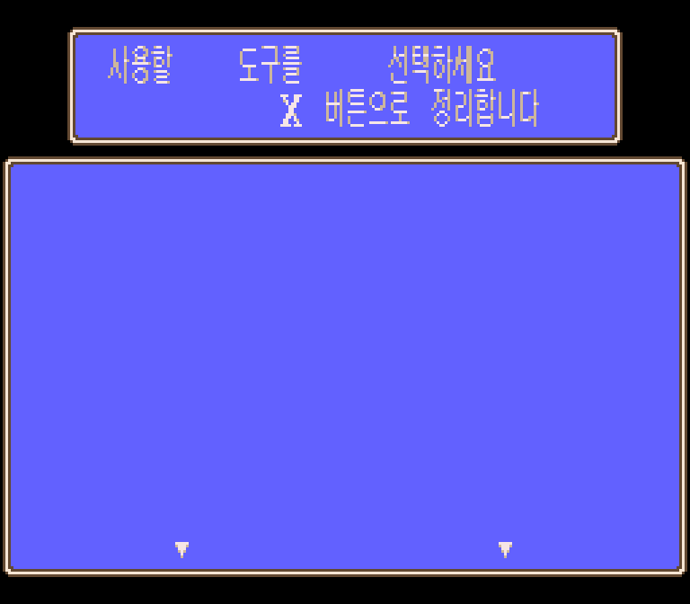

### 장비 화면

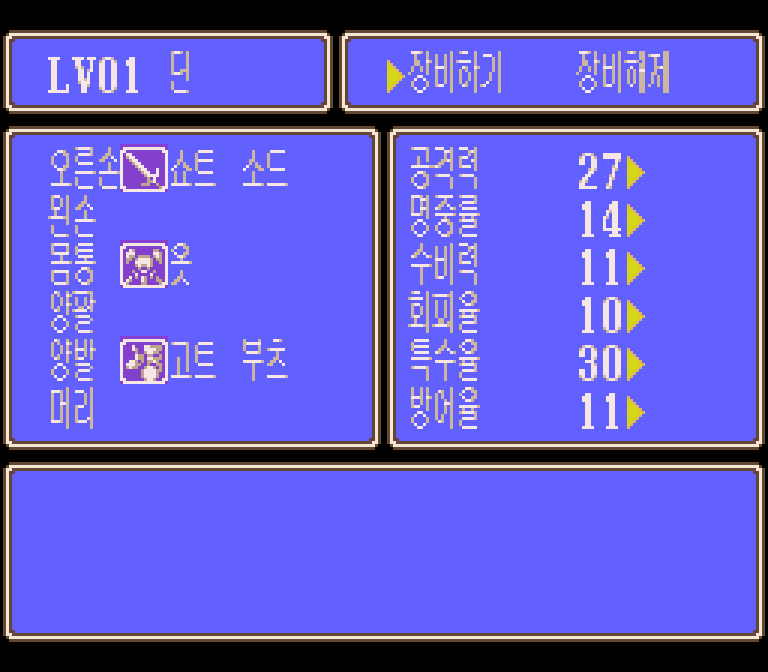

### 동료 목록과 시각

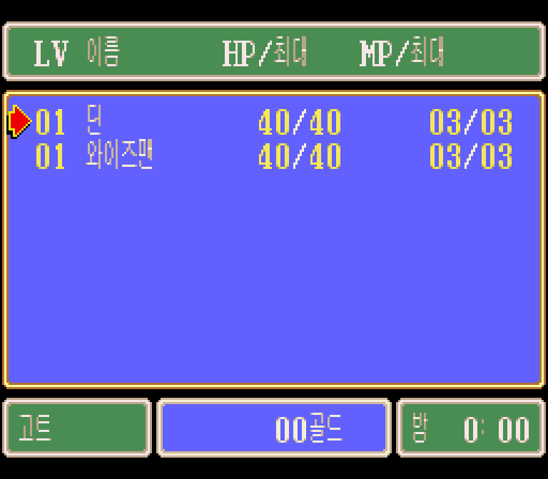

### 일반 공격과 명중률

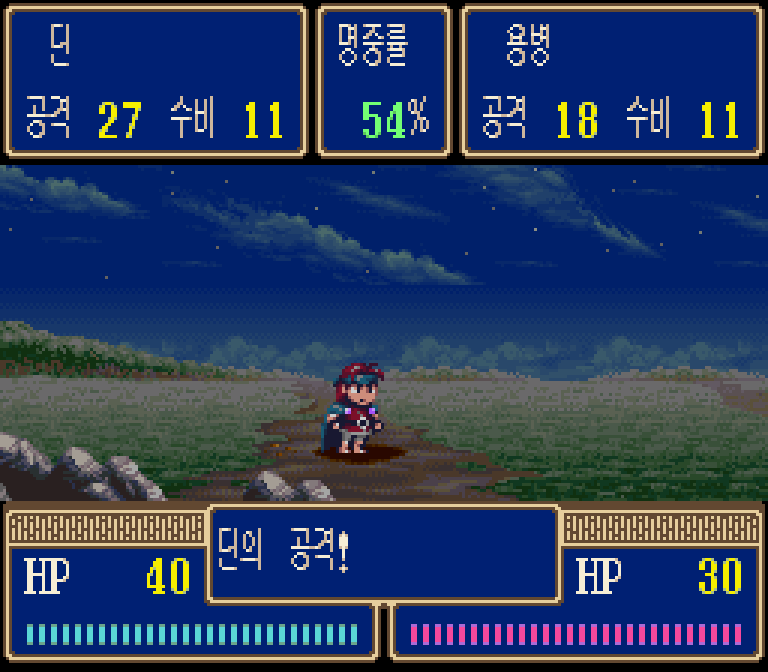

### 적의 반격

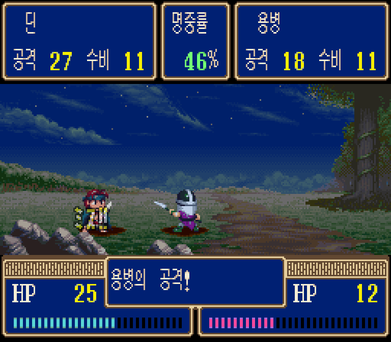

### 적의 턴 이후 필드 복귀

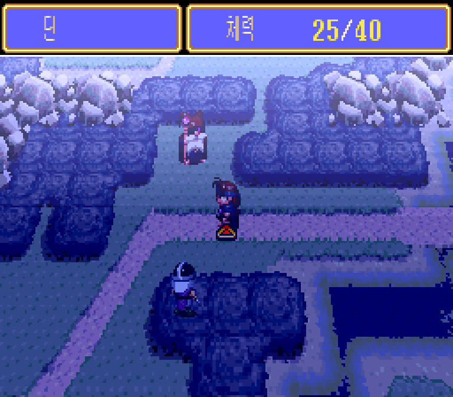

### 기합베기 사용

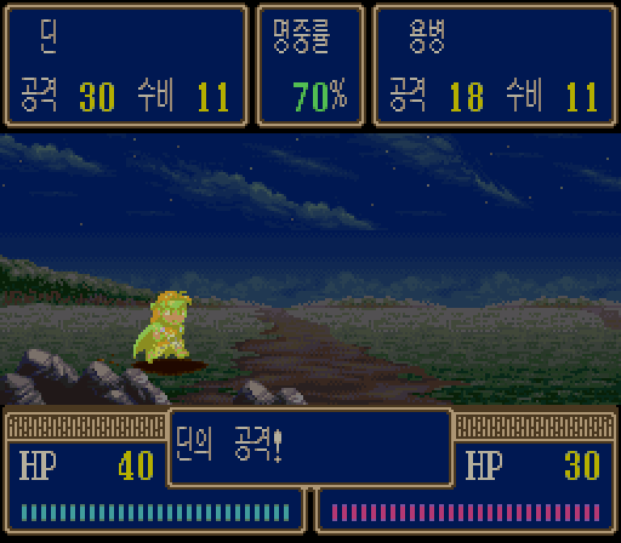

### 기술 사용 후 정신력 1 감소

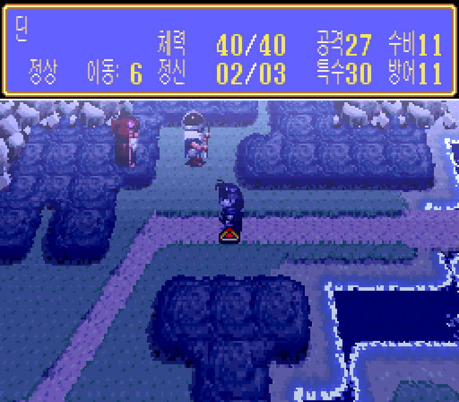
